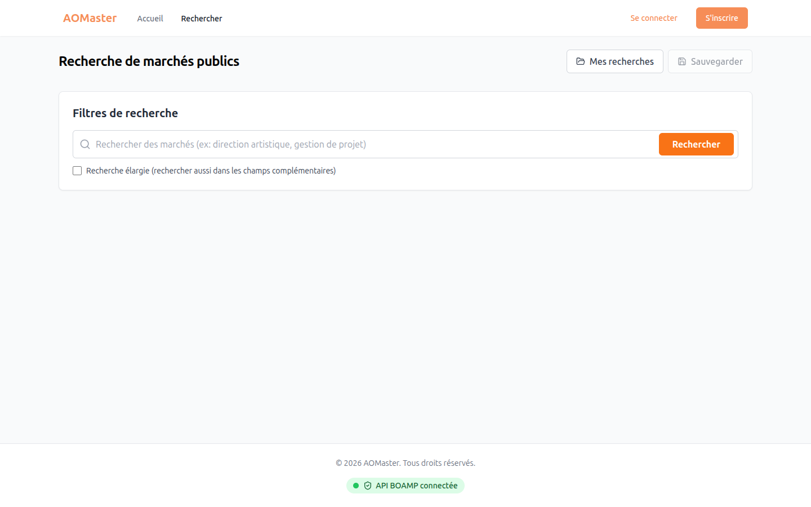
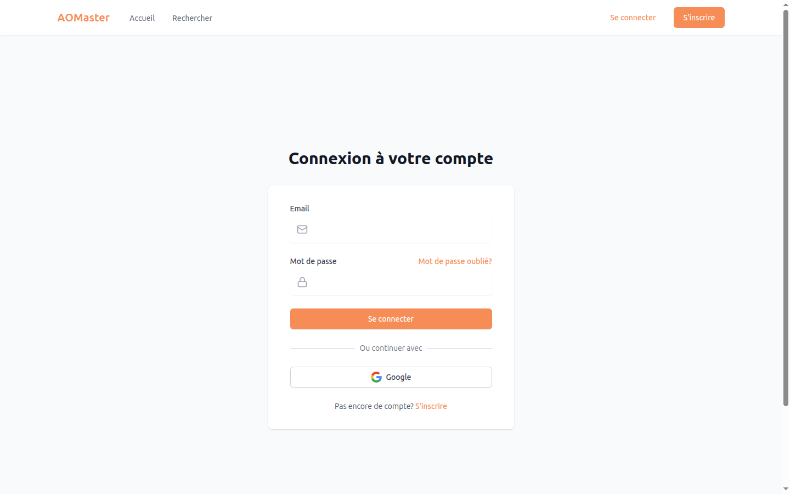
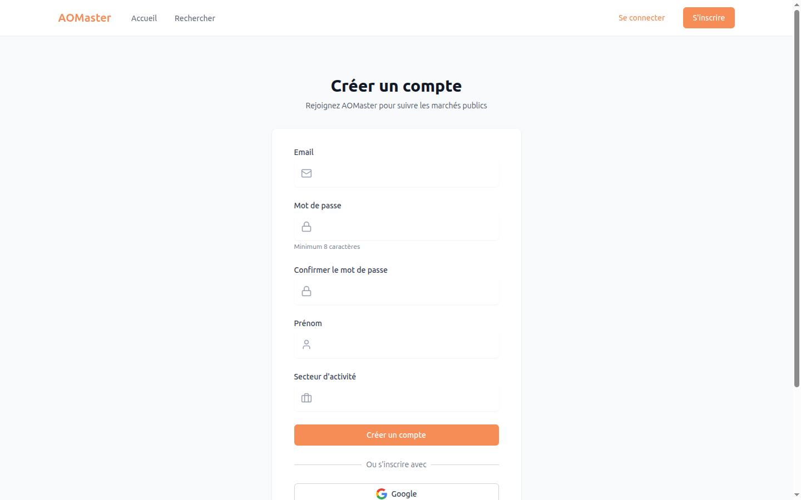

# AOMaster


Application web open-source de **veille des marchés publics français**
(BOAMP, TED). Recherche, alertes, suivi d'opportunités et favoris, conçue
pour les PME et indépendants qui répondent à des appels d'offres.

> Cette version open-source est extraite du SaaS `AOMaster` exploité par
> Dragamig SAS. Elle est livrée sans données ni branding propriétaires —
> à vous de la connecter à votre propre projet Supabase.

## Aperçu

| Accueil | Recherche |
|---|---|
|  |  |

| Connexion | Inscription |
|---|---|
|  |  |

## Fonctionnalités

- Recherche multi-critères dans les avis BOAMP et TED.
- Alertes personnalisées avec notification par email.
- Favoris et suivi d'opportunités.
- Gestion d'utilisateurs / rôles via Supabase Auth.

## Stack technique

- **Frontend** : React 18, Vite 5, TypeScript 5, TailwindCSS, TanStack Query, React Router 6
- **Backend** : Supabase (Postgres + Auth + Edge Functions Deno)
- **Validation** : Zod, DOMPurify
- **Tests** : Vitest, Testing Library, jsdom

## Installation rapide

```bash
git clone https://github.com/Flavien-Dragamig/AOMaster-oss.git
cd AOMaster-oss
cp .env.example .env       # renseigner VITE_SUPABASE_URL et VITE_SUPABASE_ANON_KEY
npm install
npm run dev
```

L'application est servie sur `http://localhost:5173`.

### Prérequis

- Node.js **≥ 18**
- npm (ou pnpm)
- Un projet [Supabase](https://supabase.com) (gratuit pour démarrer)

### Configuration Supabase

1. Créer un projet sur [supabase.com](https://supabase.com).
2. Récupérer `Project URL` et `anon public key` (Settings → API) →
   les renseigner dans `.env`.
3. Appliquer les migrations :

   ```bash
   npx supabase login
   npx supabase link --project-ref VOTRE_REF
   npx supabase db push
   ```

4. Déployer les Edge Functions :

   ```bash
   npx supabase functions deploy
   ```

5. Définir les secrets nécessaires côté Edge Functions :

   ```bash
   npx supabase secrets set SITE_URL=http://localhost:5173
   npx supabase secrets set ADMIN_EMAIL=admin@example.com
   npx supabase secrets set ADMIN_PASSWORD='ChangezMoi!2026'
   ```

Détails complets dans [`.env.example`](./.env.example).

## Scripts npm

| Commande | Effet |
|---|---|
| `npm run dev` | Démarre le serveur de dev Vite (hot reload) |
| `npm run build` | Build de production dans `dist/` |
| `npm run preview` | Sert le build local |
| `npm run lint` | Lint ESLint |
| `npm test` | Lance la suite de tests Vitest |
| `npm run test:watch` | Tests en mode watch |

## Structure du projet

```
.
├── src/
│   ├── components/     # composants UI réutilisables
│   ├── pages/          # routes (React Router)
│   ├── contexts/       # contextes React (auth, etc.)
│   ├── hooks/          # hooks custom
│   ├── lib/            # client Supabase, helpers
│   ├── services/       # appels API métier
│   ├── data/           # référentiels statiques (départements...)
│   └── tests/          # setup et tests
├── supabase/
│   ├── migrations/     # schéma Postgres versionné
│   ├── functions/      # Edge Functions Deno
│   ├── config.toml
│   └── seed.sql
├── scripts/            # scripts utilitaires (setup, fixtures)
├── Dockerfile          # conteneur de production (nginx)
└── nginx.conf
```

## Contribuer

Voir [CONTRIBUTING.md](./CONTRIBUTING.md).

## Licence

[MIT](./LICENSE) — Copyright (c) 2026 Dragamig SAS.

Les images d'illustration utilisées dans la home sont fournies par
[Pexels](https://www.pexels.com/license/) sous licence permissive.
